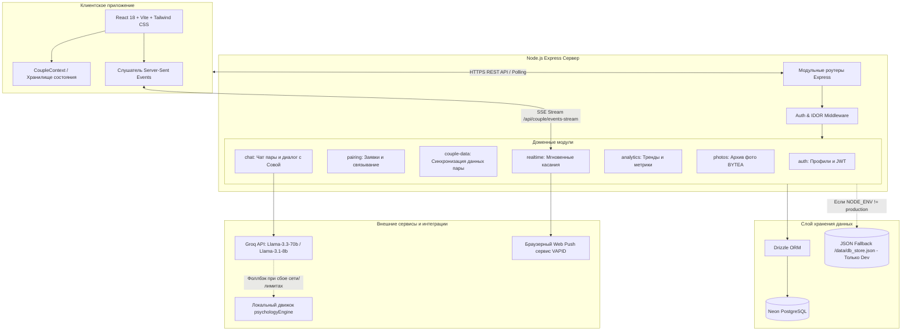

> Эта страница предназначена для инженеров, архитекторов и DevOps-специалистов, которым необходимо понимать структуру сервиса, потоки данных и принципы надёжности.

# Архитектура системы

## Общая схема компонентов

Архитектура Loop построена по классической монолитной схеме с модульным разделением серверной части и компонентно-ориентированным клиентом.

---

## Архитектурные принципы и надёжность

### 1. Строгая Fail-Fast политика в Production
В продакшн-окружении (`NODE_ENV=production`) сервер категорически не допускает работу на временном диске или с дефолтными ключами:
- **`DATABASE_URL`**: Если переменная не указана или подключение к PostgreSQL не удалось установить при запуске, сервер немедленно завершает процесс с кодом ошибки (`FATAL`). Файловый fallback в проде **полностью отключён**.
- **`JWT_SECRET`**: Запрещено использование плейсхолдеров. Отсутствие секретного ключа приводит к мгновенному падению сервера до приёма первого сетевого запроса.

### 2. Dual-Storage стратегия (Dev vs Prod)
- **Production (`NODE_ENV=production`)**: Все операции выполняются исключительно через транзакции в Neon PostgreSQL с использованием Drizzle ORM.
- **Development / Local Test (`NODE_ENV != production`)**: Если `DATABASE_URL` отсутствует, сервер мягко переключается на `/data/db_store.json`, позволяя быстро запускать приложение локально без развёртывания облачной СУБД.

### 3. Отказоустойчивость ИИ-психолога (AI Fallback Chain)
Для генерации ответов Совы применяется двухуровневая схема:
1. Запрос к **Groq API** с быстрыми моделями `llama-3.3-70b-versatile` и `llama-3.1-8b-instant`.
2. При исчерпании лимитов, отсутствии ключа `GROQ_API_KEY` или сетевом сбое управление прозрачно передаётся встроенному детерминированному модулю `psychologyEngine.ts`. Пользователь гарантированно получает валидный, структурированный психологический совет по методологии семейной терапии.

### 4. Защита от подделки прогресса (Security Strip)
При синхронизации прогресса пары через эндпоинт `POST /api/couple/sync` сервер в обязательном порядке вырезает поля `level`, `levelName`, `testsCompletedCount` из клиентского тела запроса. Уровень пары и ранги рассчитываются исключительно доверенным сервером на основе проверенных записей в базе данных.

### 5. Изоляция данных пары (IDOR Prevention)
Каждый маршрут, обращающийся к сущностям пары (`/trends/:coupleId`, `/messages/:coupleId`, `/data/:key`), защищён middleware `requirePairOwnership`. Пользователь может запрашивать и изменять только те записи, в которых его идентификатор является прямым участником пары.

---

## Структура модулей

Полное дерево исходных файлов фронтенда и бэкенда задокументировано в [PRD.md: Модульная архитектура проекта](../PRD.md#модульная-архитектура-проекта).
